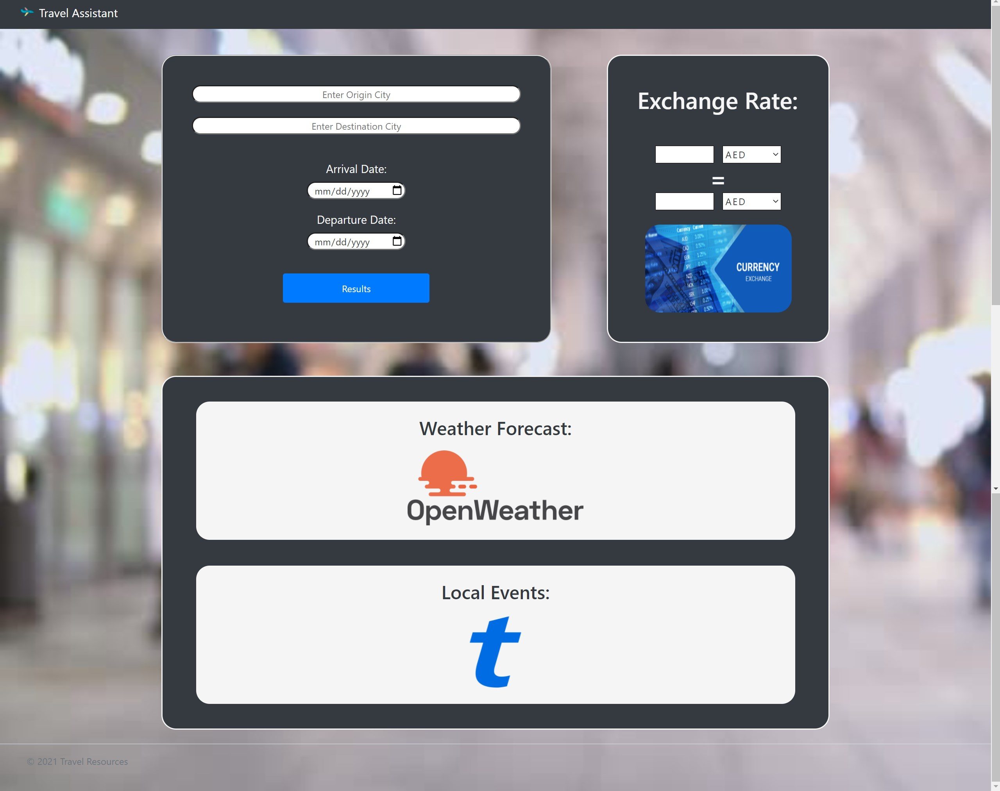

# Travel Assistant

## Description

The Travel Assistant is a one-stop-spot for information on travel destinations domestic and international. The user is first prompted with a form asking for the origin city, desired destination city, and dates of arrival and departure. Once submitted the user is then provided a 5-day forecast of the destination along with Ticketmaster events in that location during the desired timeframe. The user will also notice an exchange rate calculator so they can see the exchange rate between their home country and the destination.

## Screenshots

## Links

https://github.com/ccardinale98/travel-support

https://ccardinale98.github.io/travel-support/